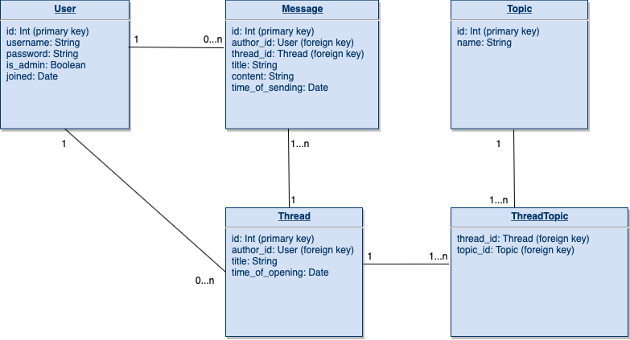

# Bulletiini
Helsingin yliopiston Tietokantaprojekti-kurssin harjoitustyö.

# Sovelluksen tarkoitus

Sovellus tarjoaa toiminnallisuuden yksinkertaiselle keskustelufoorumille. Bulletiini on usean käyttäjän sovellus, jossa käyttäjä voi käyttäjätunnuksen luotuuan lukea ja kirjoittaa viestejö ketjuihin ja aihealueisiin jaotellulla foorumilla. Tarkempi kuvaus löytyy [käyttötapausdokumentista](https://github.com/TommiON/Bulletiini/blob/master/documentation/usecases.md).

# Heroku-sovelluksen osoite ja toimivuus

_Toimivuus 7.2.2020: Heroku/Postgres kiukuttelee (jälleen kerran) asioista, jotka paikallisesti toimivat moitteettomasti, ja juuri nyt ei ole aikaa korjata tätä. Ilmeisesti yhteenvetokyselyt aiheuttavat jotain ongelmia, joten osa poluista vastaa virheellä. No can do for now._

Sovelluksen tämänhetkinen työversio löytyy [Herokusta](https://bulletiini.herokuapp.com/). Sovellukseen pääsee kirjautumaan testitunnuksella "testi" ja salasanalla "testi". Osa toiminallisuudesta (viestien lukeminen, käyttäjälista) on saatavilla myös ilman kirjautumista.

# Tietokantakaavio

